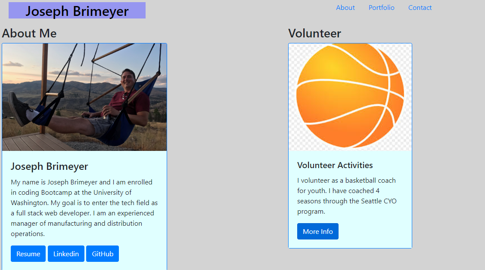

# My-Portfolio

## Description 

This project is a mobile responsive portfolio that highlights my accompolishments and interests.  The application showcases my talents and experience by allowing the user to view my web development projects, my GitHub repositories, my Linkedin profile, and my resume.  My-Portfolio was created using Bootstrap and is responsive across multiple devices.  This project will continue to evolve as I acquire additional skills in full stack web development.  My-Portfolio is an application that runs in the browser and features HTML and CSS.  In the future, I will update this app to incorporate better styling and increase the number of projects that are accessable from the site.

## Installation

My-Portfolio is hosted on github.  The installation requires that the user launch the application in their browser by clicking the following link:

https://josephbrimeyer.github.io/my-portfolio/

## Photos

Here is a photo of the deployed application:

## Usage 

Upon loading the browser page, the user can click on links to view some of my personal information, my resume, my GitHub repositories, my projects, my Linkedin profile, and my volunteering experience.

## Credits
Bootstrap: 
GitHub:
Linkedin:

## License

MIT License

Copyright (c) [2020] [Joseph Brimeyer]

Permission is hereby granted, free of charge, to any person obtaining a copy
of this software and associated documentation files (the "Software"), to deal
in the Software without restriction, including without limitation the rights
to use, copy, modify, merge, publish, distribute, sublicense, and/or sell
copies of the Software, and to permit persons to whom the Software is
furnished to do so, subject to the following conditions:

The above copyright notice and this permission notice shall be included in all
copies or substantial portions of the Software.

THE SOFTWARE IS PROVIDED "AS IS", WITHOUT WARRANTY OF ANY KIND, EXPRESS OR
IMPLIED, INCLUDING BUT NOT LIMITED TO THE WARRANTIES OF MERCHANTABILITY,
FITNESS FOR A PARTICULAR PURPOSE AND NONINFRINGEMENT. IN NO EVENT SHALL THE
AUTHORS OR COPYRIGHT HOLDERS BE LIABLE FOR ANY CLAIM, DAMAGES OR OTHER
LIABILITY, WHETHER IN AN ACTION OF CONTRACT, TORT OR OTHERWISE, ARISING FROM,
OUT OF OR IN CONNECTION WITH THE SOFTWARE OR THE USE OR OTHER DEALINGS IN THE
SOFTWARE.
## Contributing

[Contributor Covenant](https://www.contributor-covenant.org/)

